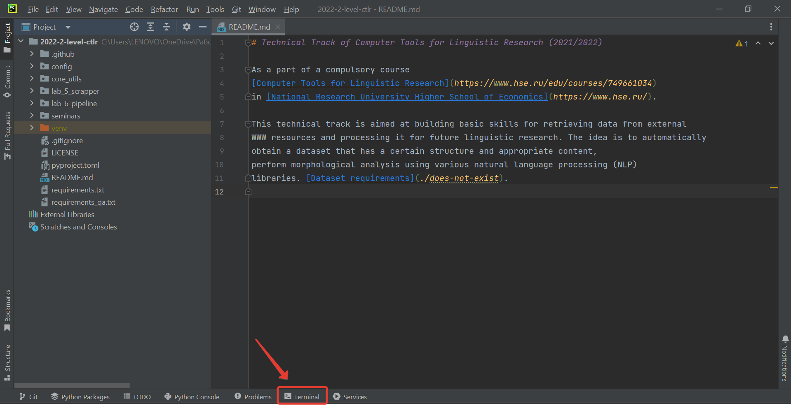

# Fork update

During the course changes will be added to the main repository (changes in tests, bug fixes,
etc.) - these changes will not automatically appear in your forks.

To add changes to your fork from the main repository, follow these steps:

1. Open the repository site sent to you by your lecturer
2. Click `Code`, select `HTTPS` and click the copy button

   

3. Open terminal in PyCharm development environment

   

4. Run `git remote add upstream <link-to-main-repository>`
5. Run `git fetch upstream`
6. Run `git merge upstream/main --no-edit`
   1. **NB**: Depending on the number of changes, the output of the command will be different.
   2. **NB**: This command will result in the latest changes from the main repository appearing
      in your local fork.
